<div align="center">

# 📚 GestionLib

### Full-stack library management — built for real use

A web app that lets students borrow books, track their loans, and manage their profiles, while giving librarians and admins full control over the catalog and usage data.

---


</div>

---

## 📋 Table of Contents

1. [Live Demo](#live-demo)
2. [About](#about)
3. [Features](#features)
4. [Tech Stack](#tech-stack)
5. [Architecture](#architecture)
6. [Screenshots](#screenshots)
7. [Getting Started](#getting-started)
8. [Environment Variables](#environment-variables)
9. [API Overview](#api-overview)
10. [Project Structure](#project-structure)
11. [Security](#security)
12. [Roadmap](#roadmap)
13. [Contributing](#contributing)
14. [Author](#author)
15. [License](#license)

---

## Live Demo

> 🚧 **Coming soon!** A live hosted demo will be available at: `https://gestionlib.example.com`

🔗 **Repository:** [github.com/oussamamachine/GestionLib](https://github.com/oussamamachine/GestionLib)

---

## About

I built GestionLib as a full-stack project to practice building real-world applications with .NET and React. The idea came from a simple problem: most library systems are either too complex or too outdated for small institutions.

The app has three roles — `Admin`, `Librarian`, and `Member` — each with their own dashboard and permissions. A student can sign up, search the catalog, and borrow a book in under a minute. A librarian sees all active loans and can flag overdue ones. An admin has full control over users, books, and data.

I picked SQLite to keep the setup friction low (no database server needed), and Vite + Tailwind on the frontend because they're fast and stay out of your way.

---

## Features

- Borrow and return books with automatic due date tracking
- Searchable, paginated book catalog
- Three roles (`Admin`, `Librarian`, `Member`) with scoped permissions
- Per-role dashboards with live stats (active loans, overdue count, catalog size)
- JWT auth via HttpOnly cookies — no tokens exposed to JavaScript
- Refresh token rotation for seamless session renewal
- Rate limiting on the login endpoint (5 req / 60s)
- Full user management for admins
- Unit + integration tests on both the API and the frontend
- Docker Compose setup for one-command deployment

---

## Tech Stack

### Frontend

| Technology      | Version | Purpose                          |
|-----------------|---------|----------------------------------|
| React           | 18.2    | UI component framework           |
| Vite            | 5.x     | Build tool and dev server        |
| Tailwind CSS    | 3.x     | Utility-first styling            |
| React Router    | 6.x     | Client-side routing              |
| Axios           | 1.x     | HTTP client for API calls        |
| Recharts        | 3.x     | Data visualization / charts      |
| Framer Motion   | 12.x    | Smooth UI animations             |
| React Hot Toast | 2.x     | Toast notifications              |
| Lucide React    | 0.5+    | Icon library                     |

### Backend

| Technology            | Version | Purpose                          |
|-----------------------|---------|----------------------------------|
| ASP.NET Core          | 7.0     | REST API framework               |
| Entity Framework Core | 7.0     | ORM for database access          |
| SQLite                | —       | Lightweight relational database  |
| JWT Bearer Auth       | 7.0     | Token-based authentication       |
| BCrypt.Net            | 4.x     | Secure password hashing          |
| Swagger / Swashbuckle | 6.x     | API documentation and testing UI |

### Testing and DevOps

| Tool            | Purpose                             |
|-----------------|-------------------------------------|
| Jest            | Frontend unit and integration tests |
| Testing Library | React component testing             |
| xUnit           | Backend unit tests                  |
| Docker          | Containerized deployment            |
| Docker Compose  | Multi-service orchestration         |

---

## Architecture

```
┌─────────────────────────────────────────────────────────────┐
│                        CLIENT BROWSER                       │
│                                                             │
│   ┌──────────────────────────────────────────────────────┐  │
│   │              React Frontend (Vite)                   │  │
│   │   - Pages: Login, Dashboard, Books, Loans, Users     │  │
│   │   - State: Context API + custom hooks                │  │
│   │   - HTTP: Axios (with cookie credentials)            │  │
│   └───────────────────┬──────────────────────────────────┘  │
└───────────────────────│─────────────────────────────────────┘
                        │  HTTPS / REST API Calls
                        ▼
┌─────────────────────────────────────────────────────────────┐
│              ASP.NET Core 7 Backend API                     │
│                                                             │
│  ┌─────────────┐  ┌───────────────┐  ┌──────────────────┐  │
│  │ Auth        │  │  Controllers  │  │  Middleware       │  │
│  │ (JWT/Cookie)│  │  Books/Loans  │  │  RateLimit/Logs  │  │
│  └──────┬──────┘  └──────┬────────┘  └──────────────────┘  │
│         │                │                                  │
│  ┌──────▼────────────────▼──────────────────────────────┐  │
│  │                   Service Layer                       │  │
│  │     BookService │ LoanService │ UserService           │  │
│  └──────────────────────────┬───────────────────────────┘  │
│                             │                              │
│  ┌──────────────────────────▼───────────────────────────┐  │
│  │           Repository / Unit of Work Pattern          │  │
│  └──────────────────────────┬───────────────────────────┘  │
└─────────────────────────────│──────────────────────────────┘
                              │  Entity Framework Core
                              ▼
┌─────────────────────────────────────────────────────────────┐
│                    SQLite Database                          │
│         Users  │  Books  │  Loans  │  RefreshTokens        │
└─────────────────────────────────────────────────────────────┘
```

---

## Screenshots

### Login
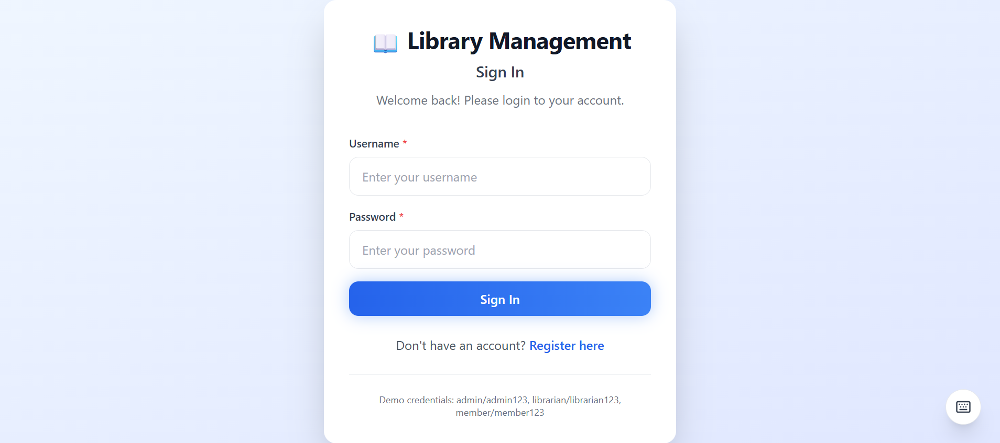

### Admin Dashboard
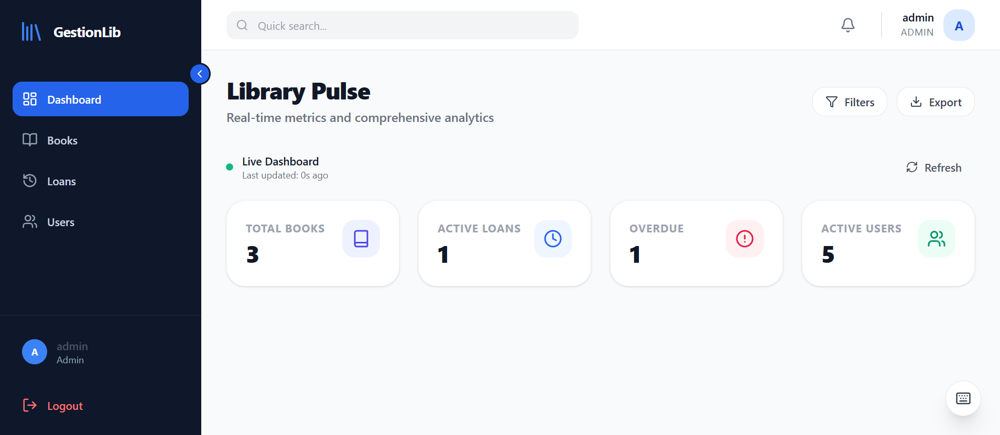

### Admin — Books
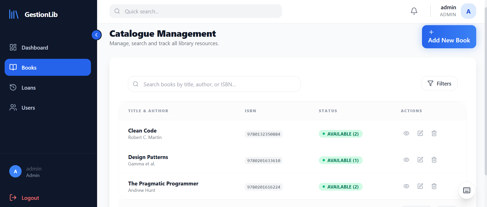

### Admin — Loans
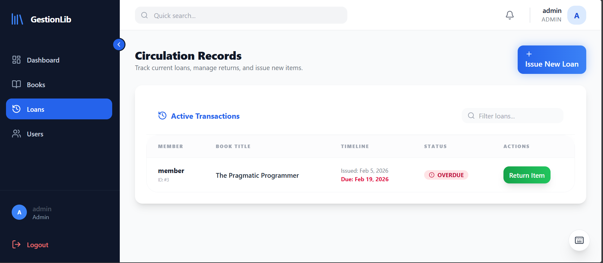

### Admin — Users
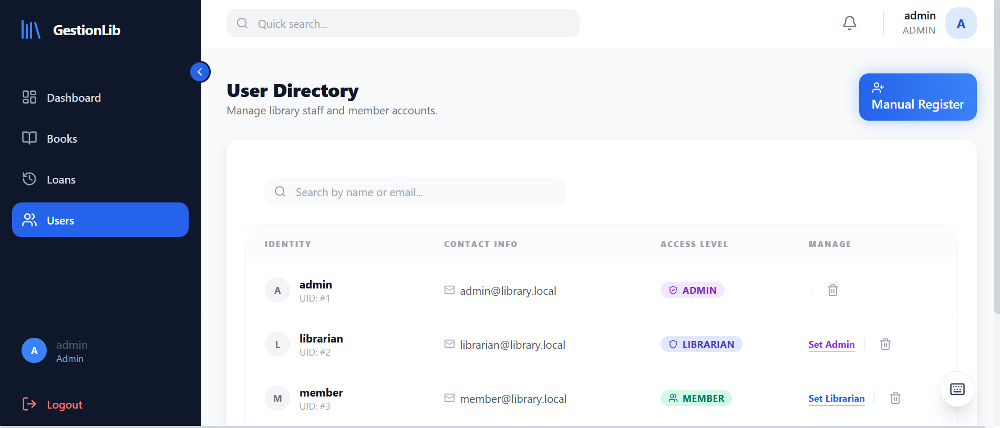

### Librarian Dashboard
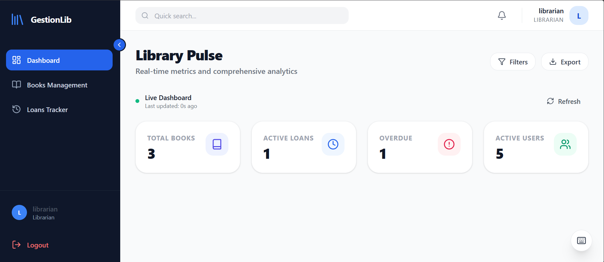

### Librarian — Books Management
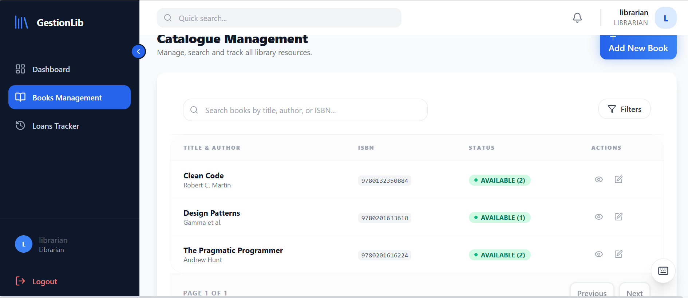

### Librarian — Loans Tracker
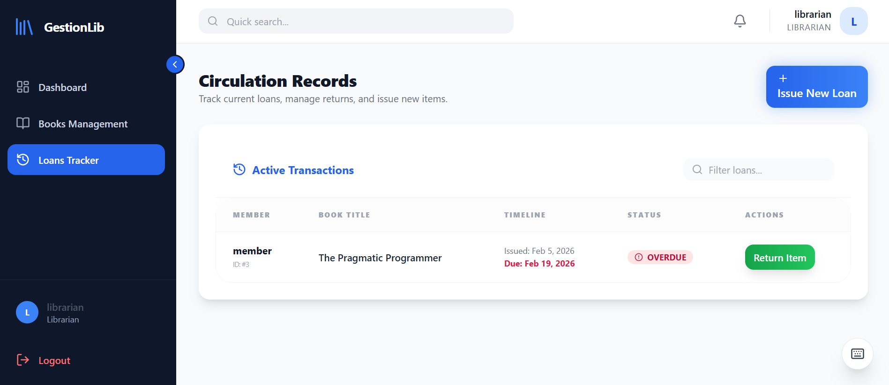

### Member Dashboard
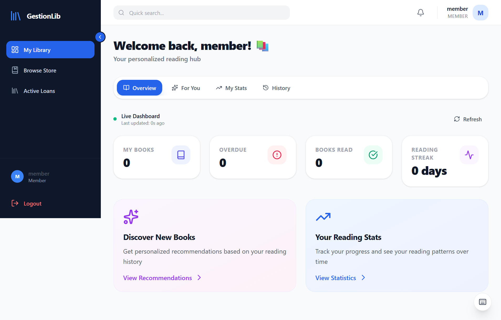

### Member — Browse Catalog
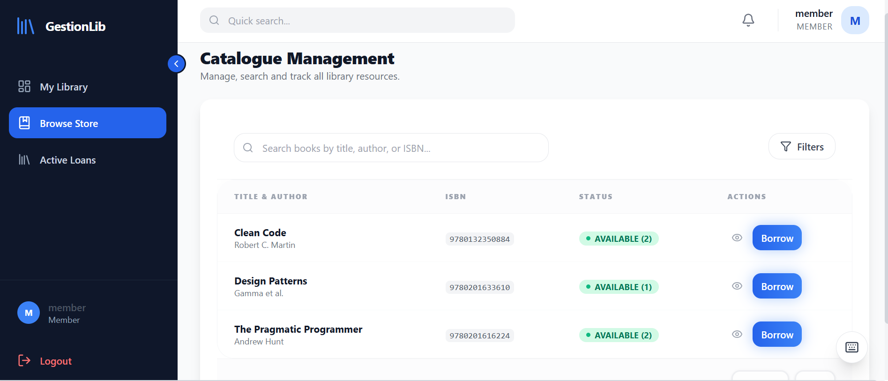

### Member — Active Loans
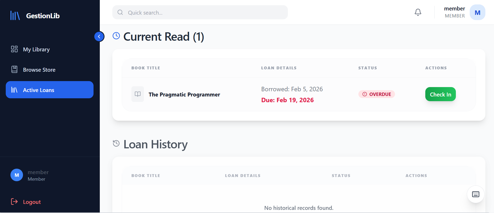

---

## Getting Started

### Prerequisites

Make sure you have the following installed:

- [Node.js](https://nodejs.org/) v18+ and npm
- [.NET SDK 7.0](https://dotnet.microsoft.com/en-us/download/dotnet/7.0)
- [Git](https://git-scm.com/)
- *(Optional)* [Docker](https://www.docker.com/) for containerized deployment

---

### 1. Clone the Repository

```bash
git clone https://github.com/oussamamachine/GestionLib.git
cd GestionLib
```

---

### 2. Run with Docker (Recommended)

The easiest way to get everything running at once:

```bash
docker-compose up --build
```

Services will be available at:

- **Frontend:** http://localhost:5173
- **Backend API:** http://localhost:5000
- **Swagger UI:** http://localhost:5000/swagger

---

### 3. Manual Setup

#### Backend

```bash
cd backend

# Restore NuGet packages
dotnet restore

# Start the API (database is auto-migrated and seeded on first run)
dotnet run
```

The API starts at `http://localhost:5000`. Swagger docs are at `http://localhost:5000/swagger`.

#### Frontend

```bash
cd frontend

# Install dependencies
npm install

# Start the development server
npm run dev
```

The frontend is served at `http://localhost:5173`.

---

### 4. Default Seeded Accounts

On first run, the database is seeded with the following test accounts:

| Role      | Username    | Password        |
|-----------|-------------|-----------------|
| Admin     | `admin`     | `Admin@123`     |
| Librarian | `librarian` | `Librarian@123` |
| Member    | `member`    | `Member@123`    |

> ⚠️ Change all default passwords before deploying to production.

---

## Environment Variables

### Backend (`backend/appsettings.json`)

| Variable                               | Purpose                                          | Required |
|----------------------------------------|--------------------------------------------------|----------|
| `ConnectionStrings:DefaultConnection`  | SQLite or SQL Server connection string           | ✅ Yes   |
| `JwtSettings:Secret`                   | Secret key for signing JWT tokens (min 32 chars) | ✅ Yes   |
| `JwtSettings:Issuer`                   | Token issuer identifier                          | ✅ Yes   |
| `JwtSettings:Audience`                 | Token audience identifier                        | ✅ Yes   |
| `JwtSettings:ExpiryMinutes`            | JWT token lifetime in minutes                    | ✅ Yes   |

### Frontend (`frontend/.env`)

| Variable            | Purpose                     | Required |
|---------------------|-----------------------------|----------|
| `VITE_API_BASE_URL` | Base URL of the backend API | ✅ Yes   |

Create a `.env` file in the `frontend/` directory:

```env
VITE_API_BASE_URL=http://localhost:5000
```

---

## API Overview

All endpoints are prefixed with `/api`. Authentication uses JWT tokens delivered via HttpOnly cookies.

### Auth

| Method | Endpoint              | Description                          | Auth Required |
|--------|-----------------------|--------------------------------------|---------------|
| POST   | `/api/auth/register`  | Register a new user                  | No            |
| POST   | `/api/auth/login`     | Login and receive JWT cookie         | No            |
| POST   | `/api/auth/logout`    | Logout and clear cookie              | Yes           |
| POST   | `/api/auth/refresh`   | Refresh access token                 | No (cookie)   |
| GET    | `/api/auth/me`        | Get current authenticated user info  | Yes           |

### Books

| Method | Endpoint             | Description                        | Roles                    |
|--------|----------------------|------------------------------------|--------------------------|
| GET    | `/api/books`         | List all books                     | Admin, Librarian, Member |
| GET    | `/api/books/paged`   | Paginated and searchable book list | Admin, Librarian, Member |
| GET    | `/api/books/{id}`    | Get a specific book                | Admin, Librarian, Member |
| POST   | `/api/books`         | Add a new book                     | Admin, Librarian         |
| PUT    | `/api/books/{id}`    | Update book details                | Admin, Librarian         |
| DELETE | `/api/books/{id}`    | Remove a book                      | Admin                    |

### Loans

| Method | Endpoint                  | Description                       | Roles                    |
|--------|---------------------------|-----------------------------------|--------------------------|
| GET    | `/api/loans`              | List all loans                    | Admin, Librarian         |
| GET    | `/api/loans/{id}`         | Get a specific loan               | Admin, Librarian, Member |
| GET    | `/api/loans/my-loans`     | Get current user's loans          | All authenticated        |
| POST   | `/api/loans`              | Borrow a book                     | Admin, Librarian, Member |
| PUT    | `/api/loans/{id}/return`  | Return a borrowed book            | Admin, Librarian, Member |

### Users

| Method | Endpoint           | Description          | Roles            |
|--------|--------------------|----------------------|------------------|
| GET    | `/api/users`       | List all users       | Admin, Librarian |
| GET    | `/api/users/{id}`  | Get a specific user  | Admin, Librarian |
| PUT    | `/api/users/{id}`  | Update user details  | Admin            |
| DELETE | `/api/users/{id}`  | Delete a user        | Admin            |

### Statistics

| Method | Endpoint           | Description                       | Auth Required |
|--------|--------------------|-----------------------------------|---------------|
| GET    | `/api/statistics`  | Get dashboard stats (role-aware)  | Yes           |

> 📄 Full interactive documentation is available at `/swagger` when the backend is running.

---

## Project Structure

```
gestion-lib/
├── docker-compose.yml          # Multi-service container config
├── gestion-lib.sln             # .NET solution file
│
├── backend/                    # ASP.NET Core 7 REST API
│   ├── Controllers/
│   │   ├── AuthController.cs
│   │   ├── BooksController.cs
│   │   ├── LoansController.cs
│   │   ├── UsersController.cs
│   │   └── StatisticsController.cs
│   ├── Data/                   # EF Core DbContext
│   ├── Domain/Entities/        # Core domain models (Book, Loan, User)
│   ├── DTOs/                   # Data transfer objects
│   ├── Middleware/             # Rate limiting, request logging
│   ├── Repositories/           # Repository + Unit of Work pattern
│   ├── Services/               # Business logic layer
│   ├── Seed/                   # Database seed data
│   ├── Validation/             # Custom validation attributes
│   ├── Program.cs              # App entry point and DI configuration
│   └── appsettings.json        # App configuration
│
├── backend.Tests/              # Backend test project
│   ├── UnitTests/              # Service-level unit tests
│   └── IntegrationTests/       # Full API integration tests
│
├── frontend/                   # React 18 + Vite SPA
│   ├── src/
│   │   ├── components/         # Reusable UI components
│   │   ├── contexts/           # Global state (Auth, etc.)
│   │   ├── hooks/              # Custom React hooks
│   │   ├── pages/              # Page-level components
│   │   ├── services/           # API call functions (api.js)
│   │   ├── utils/              # Helper utilities
│   │   └── tests/              # Frontend tests
│   ├── index.html
│   ├── vite.config.js
│   └── tailwind.config.cjs
│
└── Screenshots/                # App screenshots (replace with real ones)
```

---

## Security

A few deliberate decisions made here:

| Area                   | Implementation                                                                  |
|------------------------|---------------------------------------------------------------------------------|
| **Authentication**     | JWT tokens signed with a configurable secret key (min 32 chars)                 |
| **Token Storage**      | JWTs stored in `HttpOnly` cookies — inaccessible to JavaScript, safe from XSS  |
| **Token Refresh**      | Short-lived access tokens (60 min) + long-lived refresh tokens                  |
| **Password Hashing**   | BCrypt with work-factor salting — passwords never stored in plain text          |
| **Rate Limiting**      | Login endpoint limited to 5 requests per 60 seconds per client                  |
| **Role-Based Access**  | Endpoint authorization enforced via `[Authorize(Roles)]` on each controller     |
| **Input Validation**   | Data Annotations + custom `PasswordComplexityAttribute`                         |
| **Error Handling**     | Global exception middleware — stack traces never exposed to clients              |
| **Request Logging**    | All API requests logged with method, path, status, and duration                 |

---

## Roadmap

Things I plan to add when time allows:

- Book reservations (queue for unavailable titles)
- Email reminders for overdue loans
- Export loan history to PDF or CSV
- Book cover image uploads
- OAuth login (Google / Microsoft)
- Advanced analytics — monthly trends, peak hours, popular titles
- i18n support (French and Arabic at least)
- React Native mobile client

---

## Contributing

Feel free to open issues or submit PRs. Here's the basic flow:

```bash
# 1. Fork and clone
git clone https://github.com/oussamamachine/GestionLib.git

# 2. Create a branch
git checkout -b feature/your-feature

# 3. Make changes, then run tests
cd frontend && npm test
cd ../backend.Tests && dotnet test

# 4. Push and open a PR against main
git push origin feature/your-feature
```

Please keep PRs focused — one thing per PR makes review much easier.

---

## Author

**Oussama**  
GitHub: [@oussamamachine](https://github.com/oussamamachine)  
LinkedIn: [linkedin.com/in/your-profile](https://linkedin.com/in/your-profile)

---

## License

This project is licensed under the **MIT License**.

```
MIT License

Copyright (c) 2026 Oussama

Permission is hereby granted, free of charge, to any person obtaining a copy
of this software and associated documentation files (the "Software"), to deal
in the Software without restriction, including without limitation the rights
to use, copy, modify, merge, publish, distribute, sublicense, and/or sell
copies of the Software, and to permit persons to whom the Software is
furnished to do so, subject to the following conditions:

The above copyright notice and this permission notice shall be included in all
copies or substantial portions of the Software.

THE SOFTWARE IS PROVIDED "AS IS", WITHOUT WARRANTY OF ANY KIND, EXPRESS OR
IMPLIED, INCLUDING BUT NOT LIMITED TO THE WARRANTIES OF MERCHANTABILITY,
FITNESS FOR A PARTICULAR PURPOSE AND NONINFRINGEMENT. IN NO EVENT SHALL THE
AUTHORS OR COPYRIGHT HOLDERS BE LIABLE FOR ANY CLAIM, DAMAGES OR OTHER
LIABILITY, WHETHER IN AN ACTION OF CONTRACT, TORT OR OTHERWISE, ARISING FROM,
OUT OF OR IN CONNECTION WITH THE SOFTWARE OR THE USE OR OTHER DEALINGS IN THE
SOFTWARE.
```

---

---

If you find this useful or have questions, feel free to open an issue or reach out.
